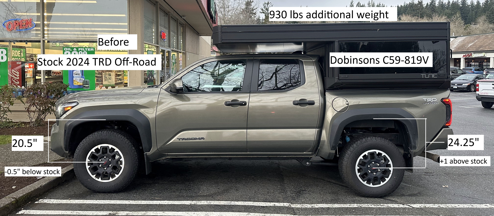
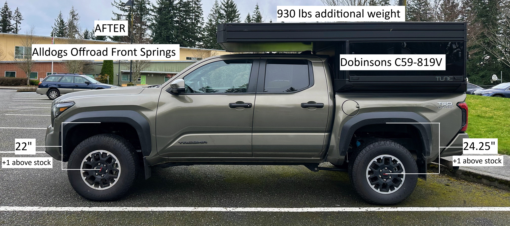
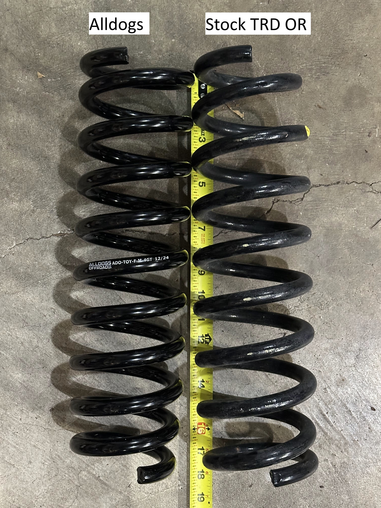

I just installed the "~1.5" taller" TOY-F-M-4GT front coil springs from Alldogs: https://www.alldogsoffroad.com/alld...t-lift-coil-springs-for-4th-gen-toyota-tacoma

<!-- truncate -->

My goal was to lift and stiffen the front to handle the additional 930 lbs of permanent weight my 2024 Tacoma has with my Tune M1 truck camper and interior build-out.

I re-used the stock Off-Road Bilstein struts.

$230 shipped, free shipping, and no sales tax in Washington, good deal!

The front ended up about 1.5" inches taller as expected! Which with my payload is 1" taller than stock, which matches my rear being 1" taller too, which is exactly what I wanted!

Handling is MUCH better, the stock Off-Road springs weren't handling the weight well (extra bounce back when going over speed bumps, and a lot of side-slosh when dropping off something one side at a time). The Alldogs springs seem perfect for this weight! It also feels smooth and soft too, doesn't seem too firm or anything. If anything, I think I need stiffer springs in the rear (don't want it taller, but the back seems like it could benefit from being stiffer), but the front is perfect now!

Install notes...

- You'll want a good quality impact wrench with 800 ft lbs breakaway. My cheap harbor freight one couldn't break off some of the nuts, I had to buy a Dewalt impact wrench
- Getting the strut aligned was a little tricky, take note of the precise angle the strut is before you remove it.
- For the alignment, Firestone didn't have the alignment specs for the 2024's yet, so they did it based on the 2023 specs... hoping Toyota releases those specs soon. I bought Firestone's lifetime alignment, so I can bring it back once they have the specs (if you're owning your vehicle for 10 years, the lifetime alignment is so worth it!)

Install took me about 6 hours (at least one hour was wasting time trying to use my cheaper impact wrench). I think I could easily do it in 4 hours next time. Shops quoted me over $800 labor (including alignment) to do it, so even with buying some new tools, I saved at least $200! If I had a full shop lift and shop tools and a nice spring compressor (instead of the rental O'reilly one), I bet I could get it done in 2 hours... kinda ridiculous they're probably quoting it at 4 hours of labor.

I'm officially happy with my suspension now! I can post some updates once I go off roading (maybe in late April). I wouldn't change a thing about the front suspension (based on my brief two days of driving), as I mentioned the only thing I'd change is potentially the rear suspension, I'd like it to be a little stiffer for all the weight, but I don't want it sitting any taller.

Here's the new springs next to the old springs. Note that they're the same length when uncompressed, but the Alldogs have one extra coil in there, and they're stiffer so the truck actually sits taller.

