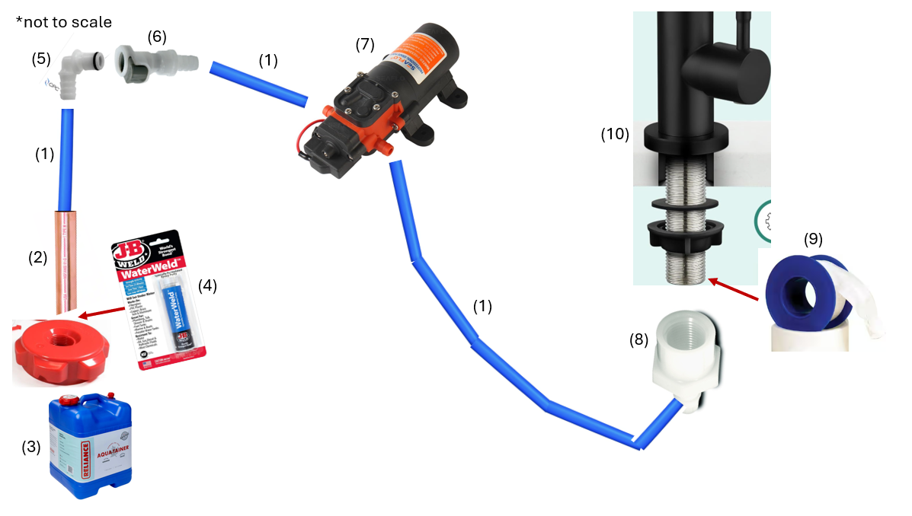
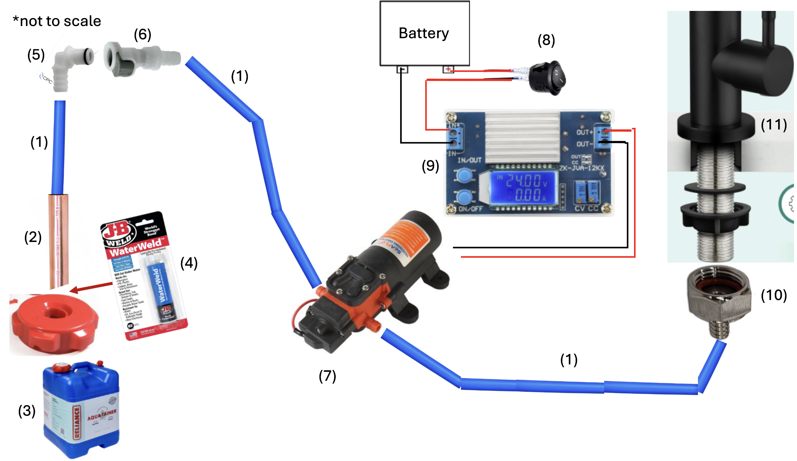
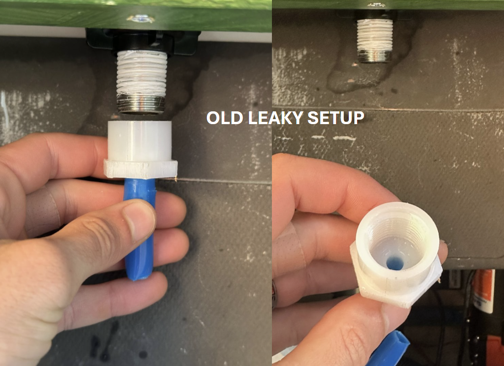
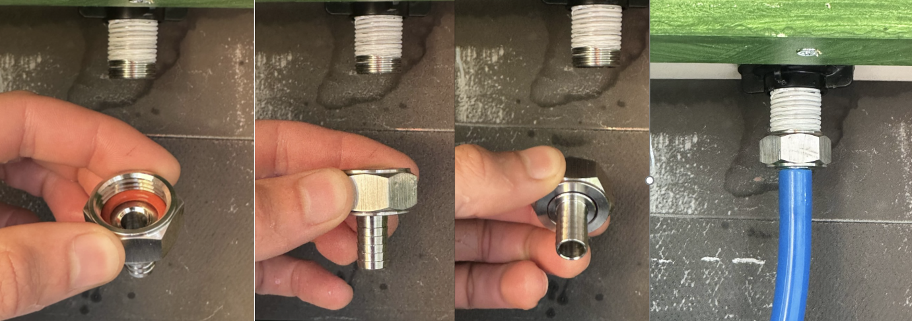

I previously used the incorrect faucet connection, which resulted in a not-perfect seal and a very tiny leak when the water was turned on. It's really tough to find a hose barb to 1/2 NPS connection - key letter being the "S" in NPS, which means **straight thread**. There's lots of connectors for NPT, which is tapered, but faucets use straight threads (sealed by a rubber gasket / washer).

<!-- truncate -->

## Old setup that leaked...

Note that part #8 was a female NPT thread, which was the problem. The faucet stem is male NPS (straight-thread). So while female NPT somewhat threads onto NPS, there's no gasket to seal it, and even plumbers tape didn't seal the gaps.

## New setup that doesn't leak

The only place I could find a 3/8 hose barb to 1/2 female NPS was from Brew Hardware: [1/2" Female NPT/NPS x 3/8" Hose Barb](https://www.brewhardware.com/ProductDetails.asp?ProductCode=NPTswivelHexNut38barb). Kinda annoying having to buy a single part from a store and pay shipping, but literally that was the only one I could find.

And it worked!! No need for plumbers tape, the included gasket seals! Plus, it's a two-piece part, so it's easier to unscrew and re-screw it in the future (since the tubing doesn't have to spin).

## Removing the old leaky setup...

Yes, there was plumbers tape the whole way down. I took this photo after I removed the plumbers tape since the new fitting didn't need it.

## Installing new correct fitting

Look at that nice rubber gasket! And how it's a two-part connection so the barb part can spin separately from the hex part!

