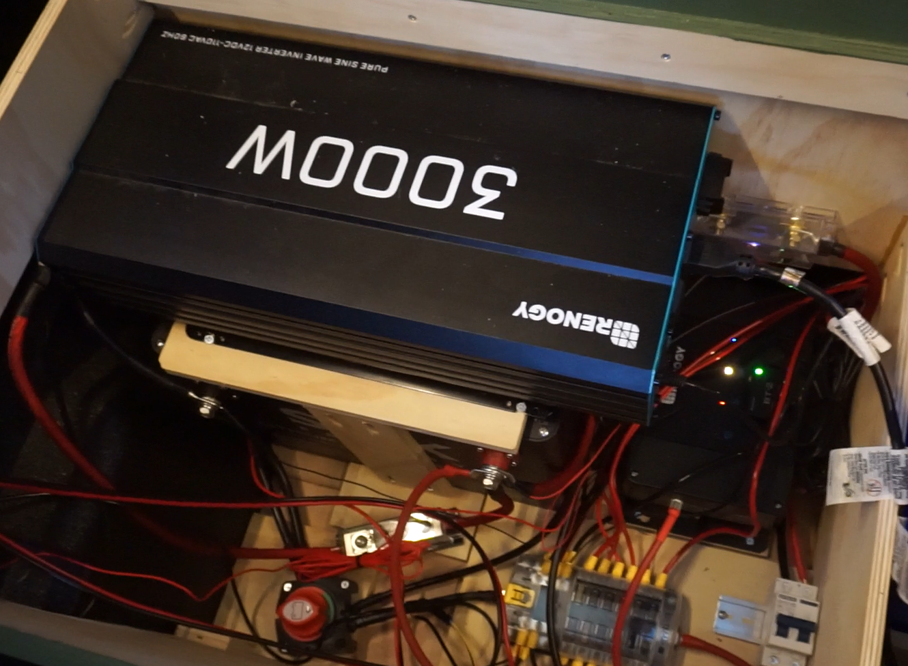
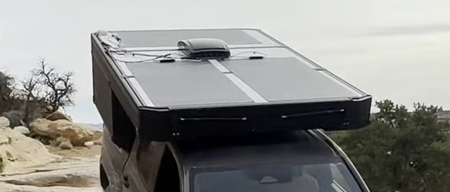

# Electrical

## Batteries

415 Ah combined (4,980 Wh)

* House battery: 280 Ah SOK LiFePOK battery
* Starter battery: 135 Ah Dakota Lithium LiFePO4 1000 CCA battery

## Solar

600W of solar

* 3x of 200W Bouge RV flexible solar panels, permanently mounted on the roof

## Alternator charging

50A alternator charging via Renogy 50A DC-DC MTTP charger (also handles charging from the solar panels)

## AC inverter

3000W Renogy Pure Sine Wave Inverter (for powering induction stove).