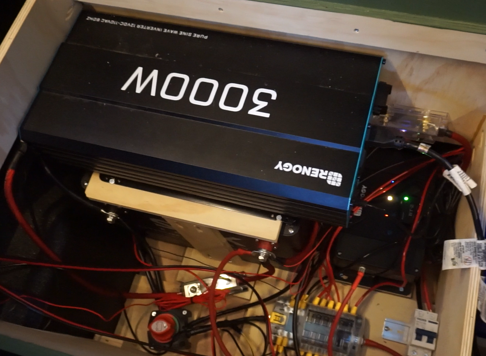

# AC Inverter

We decided to go with an induction cooktop, since it's so much faster and cleaner than gas. That meant we needed a powerful AC inverter.

We bought the [3000W Renogy Pure Sine Wave Inverter](https://amzn.to/4e6B4Dp), it's been working flawlessly!

> *I bought this gear with my own money, and no one is paying me to write this, but the links here are Amazon Associate affiliate links that help support my content - and they don't cost you anything - same price as if you went to Amazon directly!*

## Fuse for inverter

The fuse you use between the battery and inverter is **VERY IMPORTANT**, since it's carrying a HIGH amperage, meaning cheap-quality fuses will melt (I had it happen).

Make sure to buy the type of fuse where you have to have actual crimped connectors, you need a solid metal-on-metal connection.

I bought the [Renogy 400A Set w Holder ANL Fuse](https://amzn.to/4fEhBuU) after a previous cheaper one melted, and the Renogy one has been working flawlessly. It's worth it going name brand!

## Stove

For our stove, we got the [Nuwave Gold Precision Induction Cooktop](https://www.amazon.com/dp/B01CHB1Y22?ref=t_ac_view_request_product_image&campaignId=amzn1.campaign.1B52VZJZ2DYF3&linkCode=tr1&tag=roamapps-20&linkId=amzn1.campaign.1B52VZJZ2DYF3_1781319646099), it's way better than the Duxtop brand... the Duxtop doesn't let you "simmer" things at a low enough setting, meaning you'll even burn oatmeal! But the Nuwave works perfectly for oatmeal and other lower-temp simmers, and also heats up crazy fast, and has tons of temperature levels for precise cooking! You can also [build a leveling stove top](../kitchen/leveling-stove-platform.md)!