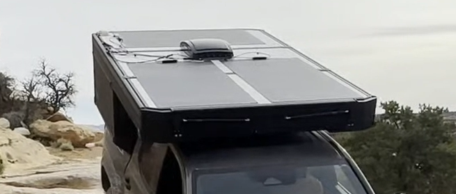
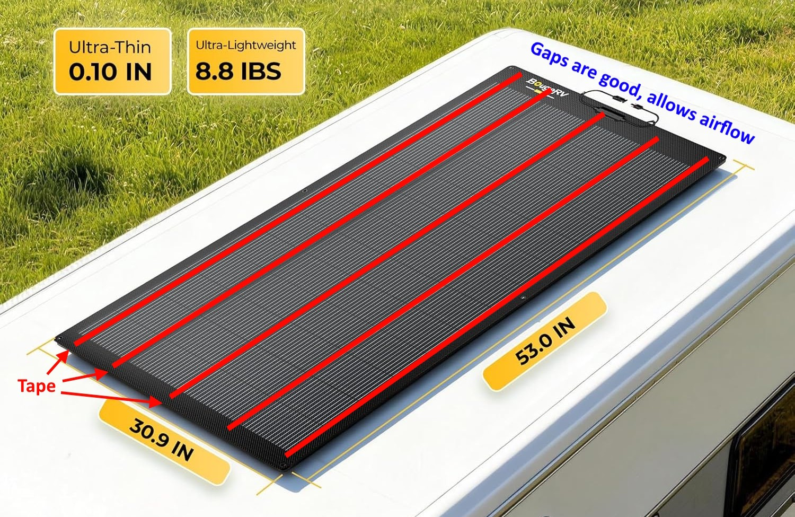
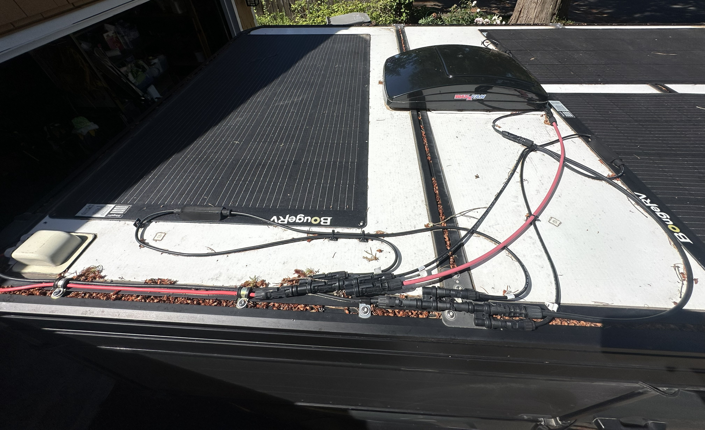

# Solar panels

I managed to fit 600W of solar panels on the roof of our Tune M1 (built for the 5' bed 2024 Tacoma)!

**Buy 3x of the 200W panels here: https://amzn.to/4xwVxci**

> *I bought this gear with my own money, and no one is paying me to write this, but the links here are Amazon Associate affiliate links that help support my content - and they don't cost you anything - same price as if you went to Amazon directly!*

## Review after 1+ year and 30k miles

I went with the [BougeRV Arch 200W flexible panels](https://amzn.to/4xwVxci), and secured them on with 3M tape, and after over a year and 30,000 miles of driving, including highway speeds of 80 mph, there have been ZERO issues! I'd highly recommend them!

<iframe width="560" height="315" src="https://www.youtube.com/embed/5mJV-Z-15M" title="YouTube video player" frameborder="0" allow="accelerometer; autoplay; clipboard-write; encrypted-media; gyroscope; picture-in-picture; web-share" referrerpolicy="strict-origin-when-cross-origin" allowfullscreen></iframe>

## Parts

You'll need the following parts...

Part | Description
--|--
[3x BougeRV Arch 200W flexible panels](https://amzn.to/4xwVxci) | Your solar panels! I bought 3 of them.
[3M Scotch 5952 Tape](https://amzn.to/442BapE) | This is the best tape to adhere your flexible panels onto roofs! I think I bought 4 of them and that was just enough.
[Short connector extension](https://amzn.to/4ow0FJC) | You'll need to extend one of your solar panels up top. I forget which I bought (I think I had one sitting around), but I think 3 ft is plenty.
[2x of Y Connectors](https://amzn.to/3QhoY16) | The first one lets you connect 2 panels into one output... and the second one lets you combine the 3rd panel with the output of the combined 2, so you have one single output!
[40A circuit breaker](https://amzn.to/4vPV6YQ) | Safety measure, installed before your solar connects to your DC-to-DC charger. Should be sized for your voltage and amps, 40A is sufficient for the panels I recommended.
[50A DC-to-DC charger](https://amzn.to/3S6bc1V) | I bought the Renogy DC-to-DC charger, it combines both solar and alternator charging and has worked well!
Wiring | Correct guage wiring for the distance you're running from the rest of the distance from your panels to your DC-to-DC converter!
[Solar Connector Tool](https://amzn.to/4e8Kazq) | Tool that helps disconnect solar connectors... they're actually a pain to disconnect without it!

## Adhering the solar panels

On the backs of the solar panels, apply about 5 strips of the [3M Scotch 5952 Tape](https://amzn.to/442BapE) along the LONG direction of the solar panel. It's CORRECT to leave the edges unsealed, it's GOOD for there to be some airflow possible. After 30k miles of driving, my panels are still perfectly stuck on. I even used to have a panel on a curved rooftop cargo carrier, stuck on the same way, and it was totally fine! This tape is STRONG!

## Connecting the panels

Your furthest away solar panel will need a short (maybe 3ft) [connector extension](https://amzn.to/4ow0FJC), but then after that you simply attach those upper two with your first [Y Connector](https://amzn.to/3QhoY16), and then directly in the end of the first Y Connector, you attach your second Y connector and add in the third panel!

## Connecting your DC-to-DC charger

Before your wires go into your [50A DC-to-DC charger](https://amzn.to/3S6bc1V), you want to have a fuse or circuit breaker. I used this [40A circuit breaker](https://amzn.to/4vPV6YQ) (plenty for these panels), which also gives me a way to turn off the solar panels if I want to.