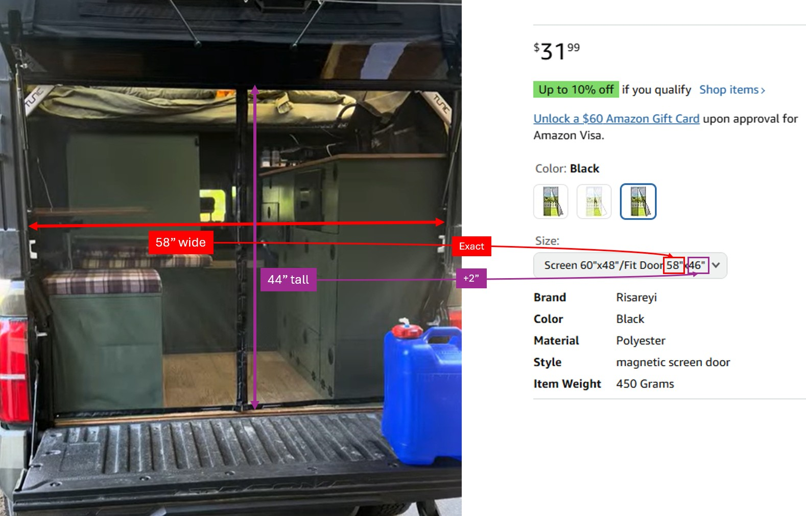

# Bug net

Adding a bug net to the rear entrance is a must-do! It's so nice not having bugs fly in, and not feeling like you have to rush to close everything!

<iframe width="315" height="560"
src="https://www.youtube.com/embed/WnsS_NrIoBM"
title="YouTube video player"
frameborder="0"
allow="accelerometer; autoplay; clipboard-write; encrypted-media; gyroscope; picture-in-picture; web-share"
allowfullscreen></iframe>

## Which brand to buy

I bought this bug net from Amazon: https://a.co/d/gfc8liY

It's custom size for both height and width, so no cutting or trimming needed!

Shipping takes a while (~15 days), but it's nice not having to cut anything!

## What size to buy

Measure the width and height of your rear opening (the opening itself, as seen in the photo below). Then, compare this size to the **"Fit Door"** values on the Amazon page. The actual screen dimensions will be +2" on each dimension.

* Fit Door width should be EXACTLY the width of your opening. If your width is an odd number, like 57", I'd probably round down to 56". There seemed to be plenty of extra width that I'd go smaller rather than going larger.
* Fit Door height should be +2" the height of your opening. If your height is an odd number, like 43", I'd add the 2 (45") and then round down to 44".

## Installing

Installation is pretty straightforward.

1. Dry fit the net, see if it's working.
1. Figure out where the top of your net will mount. Most likely it's going to be as high as possible, coming right up to the bottom arm supports of the Tune. You want the bottom of the net slightly hovering off the ground so it can swing freely to re-close itself.
1. Put the velcro on at the top. I didn't have the net on during this since it was easier to apply the velcro without the net, and I knew roughly exactly where the velcro should go.
1. Stick the bug net onto the top velcro. Figure out where the side velcro will go.
1. Attach the side velcro to the upper half (you may need to move your light switch slightly).
1. For the bottom half, things get more complicated. I just tucked the bottom half behind my seat / cabinet, and then used one of the included finishing nails to tack on the bottom left and right of the net to my seat / cabinet.

## Final thoughts

Works really well! It's slightly tougher to get in and out, but just barely, and the convenience of not having bugs get in is so worth it! There are a couple gaps in the net along the magnetic closure depending on how it rests and reconnects, but we really haven't seen bugs fly in through those yet, and I think they're kinda necessary to make it easier to open the net.