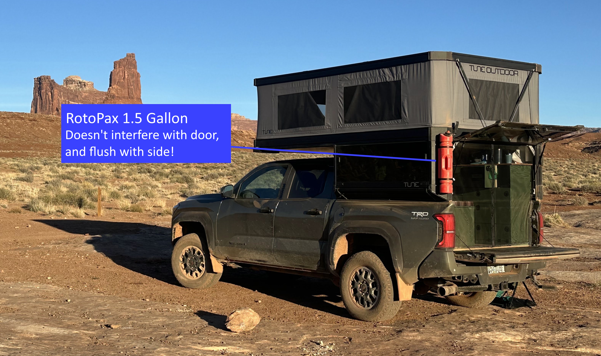
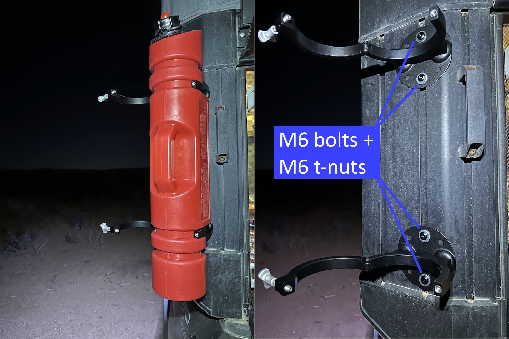

# Gas can

Having extra fuel on hand is essential for longer trips, especially when boondocking or traveling through remote areas. Mounting a gas can to the Tune's exterior keeps it safely stored and easily accessible without taking up valuable interior space.

## Which brand to buy

I bought the **RollpaX 1.5 Gallon Gasoline** container from RotopaX: https://www.rotopax.com/products/rollpax?variant=43536536240282

When ordering, make sure to select the **"Flat Bottom Hardware"** option. This hardware is necessary for mounting to the Tune's t-track system.

## Installing

Installation uses the Tune's exterior t-tracks, which makes mounting very straightforward.

### Hardware needed

* 4x M6 bolts (12mm length)
* 4x M6 t-nuts
* The flat bottom mounting plates that come with the RollpaX

**Important:** M6 bolts are the correct size for the RollpaX mounting plates. M8 bolts are too thick and won't fit through the mounting holes.

### Installation steps

1. Decide where you want to mount the gas can on your exterior t-tracks.
1. Insert the M6 t-nuts into the t-track channels.
1. Position the RollpaX with its flat bottom mounting plates aligned with the t-nuts.
1. Thread the M6 bolts through the mounting plates and into the t-nuts.
1. Tighten securely, but don't over-tighten as you may strip the threads.

## Final thoughts

The RollpaX mounting system works great with the Tune's t-track system. The 1.5 gallon capacity provides a good safety margin for extended trips without being too heavy or bulky. The flat bottom hardware makes installation and removal straightforward if you need to take it off for any reason.
