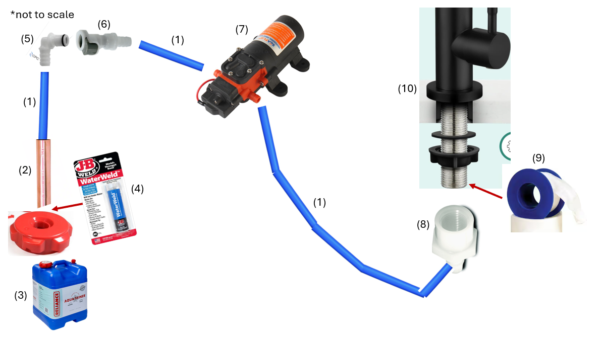

# Fresh Water Plumbing

This was kind of tricky, since you have to find the right tube sizes and the right adapters that fit your water containers, faucet, and water pump.

I designed my system to work with **3/8" inner-diameter** tubing.

Number | Item
--|--
\#1 | **[3/8" ID polyethylene tubing](https://www.freshwatersystems.com/products/blue-1-2-od-lldpe-polyethylene-tubing?variant=50723158294712)** (from Fresh Water Systems) For literally all the tubing, including pick-up tube and tubing for the faucet. Tastes great, no plastic taste!
\#2 | **[1/2" ID copper tube](https://www.homedepot.com/p/Mueller-Streamline-1-2-in-x-2-ft-Copper-Type-M-Pipe-MH04002/100553697)** (from Home Depot) For the pick-up tube, so that the polyethylene tubing stays straight inside the fresh water container
\#3 | **[Reliance Aqua-Tainer 7 Gallon Water Container](https://www.walmart.com/ip/Reliance-Aqua-Tainer-Water-Container-7-Gallon-9410-03/872426)** (many stores) Fresh water tank
\#4 | **[JB WaterWeld Putty](https://a.co/d/iEJzFE6)** (many stores) For attaching copper tube to Aqua-Tainer lid
\#5 | **[Elbow quick connect](https://www.usplastic.com/catalog/item.aspx?itemid=146406&catid=926)** (from US Plastic) Stays on the water container lid and is what my quick connect tube plugs into. Elbow style was important to minimize the height (so the tubing goes horizontal from the lid).
\#6 | **[Quick connect with valve](https://www.usplastic.com/catalog/item.aspx?itemid=146386&catid=926)** (from US Plastic) Getting a valved version is important so that when you disconnect it, it doesn't spill water out!
\#7 | **[Seaflo 35 PSI water pump](https://www.amazon.com/gp/product/B00DLKT4OO)** (from Amazon) 35 PSI is plenty of pressure for a small kitchen faucet!
\#8 | **[Rocker switch](https://www.amazon.com/dp/B07S1MV462)** (from Amazon) So you can turn the pump off when not using it.
\#9 | **[DC Buck Converter](https://www.amazon.com/dp/B078Q1624B)** (from Amazon) This is needed to make the pump quieter. The pumps can run at a range of voltage, something like between 3V and 20V (higher voltage means more pressure)... if you have a Lithium battery, those are usually at 13.6V when full, which is higher than standard 12V batteries. That made the pump SUPER LOUD. Reducing it to ~10V seems pretty nice and still plenty fast.
\#10 | **[1/2" Female NPT/NPS x 3/8" Hose Barb](https://www.brewhardware.com/ProductDetails.asp?ProductCode=NPTswivelHexNut38barb)** (from Brew Hardware) You need to find a female NPS fitting (with a gasket). NPT doesn't fit onto the base of the sink faucet, T == tapered, and the threads are straight (NPS). I could only find this from Brew Hardware, but it worked and was leak proof!
\#11 | **[Cold Water Only Faucet](https://www.amazon.com/gp/product/B09WTQZF7K)** (from Amazon) Getting a cold-water only faucet is nice!

## Tubing

Make sure you buy drinking water safe (NSF 61 certified) tubing. I went with **Polyethylene** tubing since that seemed to have the least taste according to people online, and my wife is picky about plastic taste. I'm happy to report that she actually thinks the water from the system tastes okay!

I bought 3/8" inner-diameter (1/2" outer-diameter) tubing from Fresh Water Systems: [Neo-Pure 1/2" OD LLDPE Polyethylene Tubing in Blue](https://www.freshwatersystems.com/products/neo-pure-1-2-od-lldpe-polyethylene-tubing-in-blue?sku=LLDPE8-BLUE%3A5FT&variant=41912902910136).

## Water pump

You don't need anything super high pressure for just a faucet. I bought the [SEAFLO 35 PSI pump](https://www.amazon.com/gp/product/B00DLKT4OO/ref=ppx_yo_dt_b_search_asin_title?ie=UTF8&psc=1), which has been plenty of pressure.

It's definitely noisy when you're using the water, but the convenience of having an adjustable speed faucet is really nice.

Using the DC Buck Converter mentioned above helps keep the noise down. 

## Power switch for water pump

You'll need your own power switch so you can remotely turn off the water pump. I bought a small [DaierTek Round Rocker Switch](https://www.amazon.com/gp/product/B07S1MV462/ref=ppx_yo_dt_b_search_asin_title?ie=UTF8&psc=1), and wired that between the positive cable of the water pump, so I can turn it on and off.

## Faucet

Most faucets have both cold and hot water hookups. Finding a cold-water only faucet is a little difficult. I found this [Cold Water Only Faucet from Amazon](https://www.amazon.com/gp/product/B09WTQZF7K). It's worked well so far!

