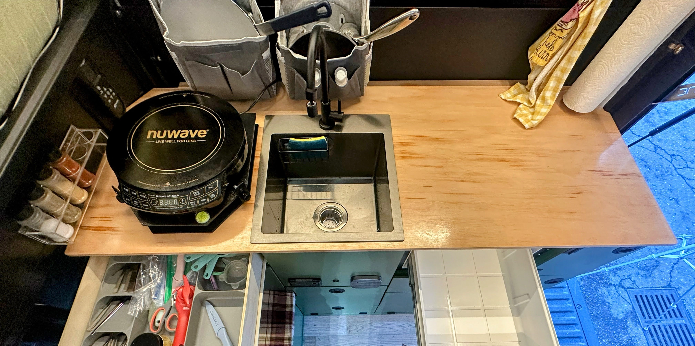

# Sink

We used a sink that's 13" x 13" on the interior with an 8" depth. This size seemed to be perfect, doesn't take up too much space, yet is deep and big enough that we can easily wash pots/pans in it.

This is the sink we bought: [MENATT 15 x 17 Inch Drop in Kitchen Sink, 18 Gauge Stainless Steel Single Bowl Single Faucet Hole Topmount Kitchen Bar Sink or Prep Sink (Black)](https://www.amazon.com/gp/product/B0CL8ZMN7C/ref=ppx_yo_dt_b_search_asin_title?ie=UTF8&th=1).