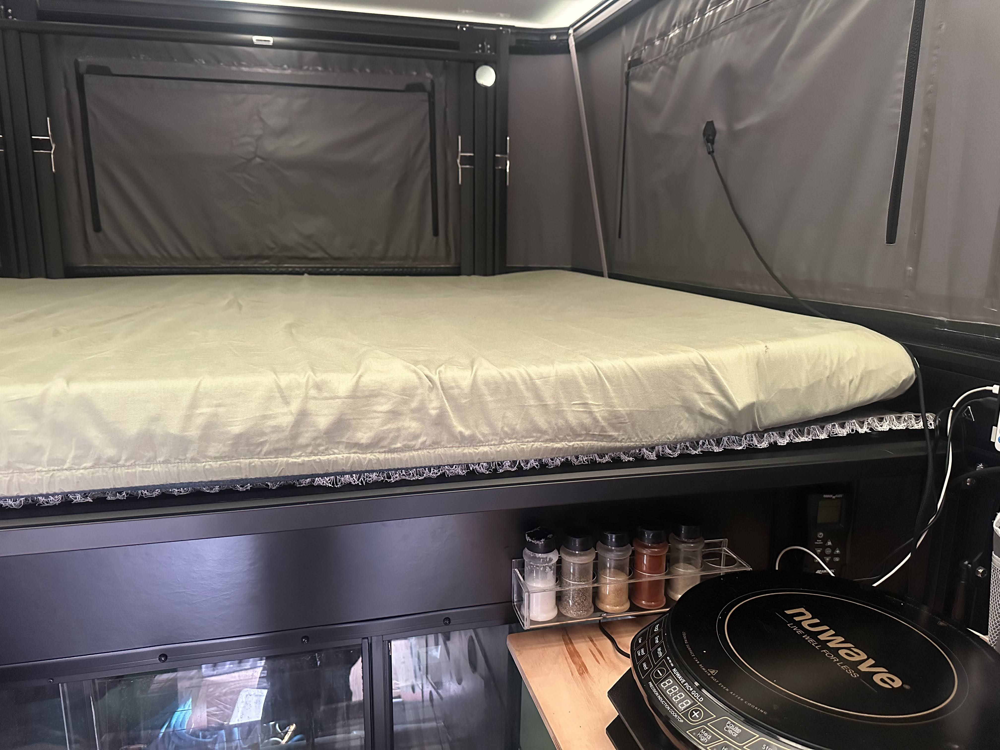
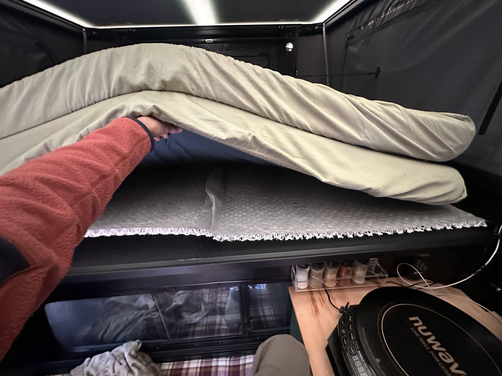

# Mattress Underlayment

A mattress underlayment protects against moisture and mildew by giving 3/4" of airflow underneath the entire mattress. As we mentioned in our [one year Tune M1 review](/blog/tune-m1-one-year-review), our Tune did have a couple small leaks, so keeping air flowing under the mattress gives you a little safety in case of leaks.

## Which one to buy

I bought the [AquaShield™ Breathable Mattress Underlayment for RV](https://www.ablifestyles.net/aquashield-breathable-mattress-underlayment-for-rv/) from AB Lifestyles, size **"60x72 Sofa"**.

**Note:** you have to scroll down to the bottom of the page to see the sofa sizes.

That size fits the Tune's mattress (non-King-size) — no cutting needed!

## Closing the Tune with the underlayment installed

The underlayment does take up 3/4" of height, but we can still leave our pillows and most typical blankets on the bed when closing the Tune — no need to remove bedding every time.

## Long-term durability

After a full year of use, the underlayment hasn't collapsed at all — it's still holding strong!

