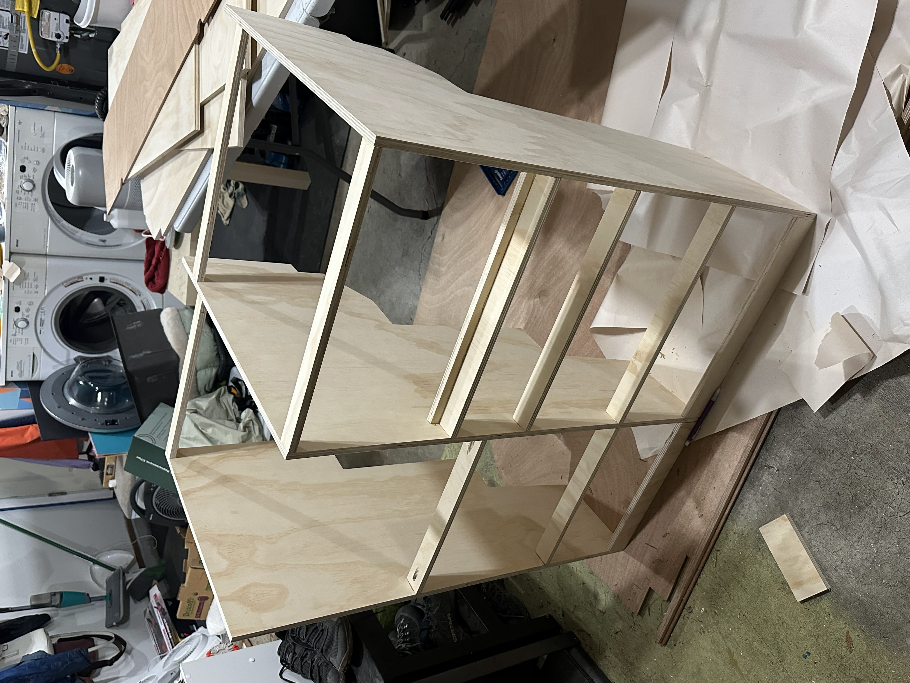
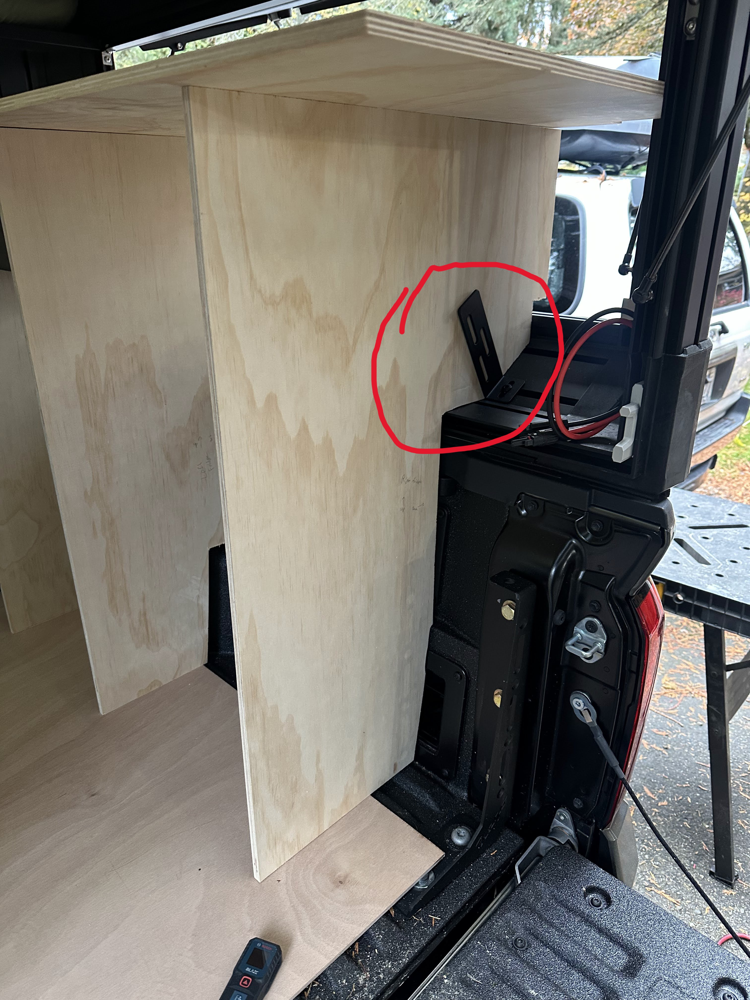

# Cabinets

The cabinets are built primarily using 1/2" plywood, and the drawers are a mixture of 1/4" and 1/2".

## Attaching the cabinets

The bottom of the cabinets are glued down to the floor (since the floor is only 1/4" plywood, gluing is the only option), and then the backs of the cabinets are attached with some brackets that fit M8 bolts and attach to the t-track.

Brackets: https://a.co/d/eZr0nxv

To attach the brackets to the wood, I used a fender washer and a wood screw (fender washer necessary to make it big enough to fit the gaps).

On the far left side, I attached the left side of the cabinet directly to the left t-track with some deeper M8 bolts.