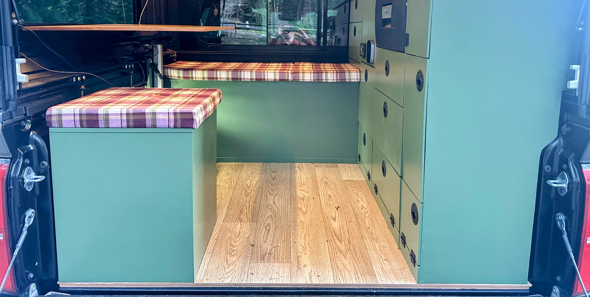

# Flooring

The flooring is...

* 1/4" marine plywood from Emerson Hardwood
* Underside sealed with marine sealer
* Sheet vinyl flooring from Home Depot

So far, I haven't felt a need for insluation or using thicker wood. The coldest we camp in is lows of around 32F, so it's been fine with us. And we used wood glue to attach wood to the base. The stock bed ridges are frequent enough that the floor doesn't bend anywhere even though it's just 1/4". Saving weight was important!