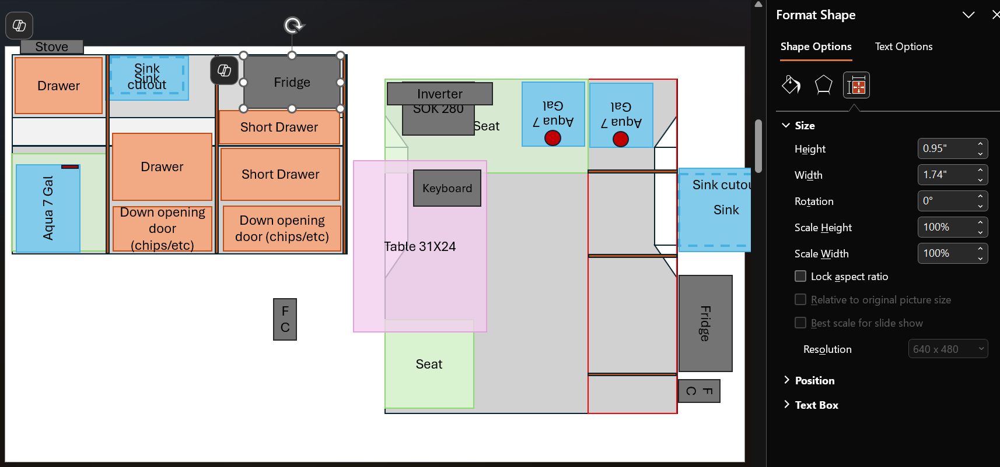

# Plans

I mostly used PowerPoint to plan out the build. I put in everything at 1/10th scale, so dimensions like 1.74" in PowerPoint equals 17.4" in real-life.

You can [download the PowerPoint here](./img/Tacoma%20Tune%20Build.pptx).