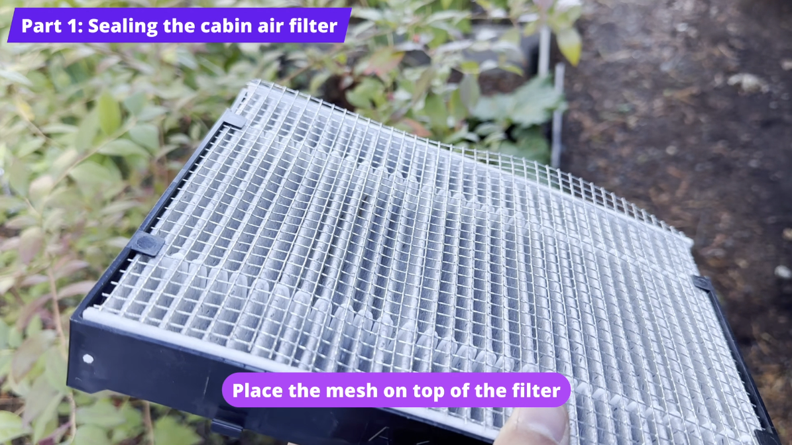

# Mouse proof the cabin air filter

Mice can get into the cab through the cabin air intake, which leads to the cabin air filter behind the glovebox. Laying a piece of hardware cloth over the existing filter blocks that path.

## Parts

* [1/4" hardware cloth](https://www.homedepot.com/p/Everbilt-1-4-in-Mesh-x-2-ft-x-5-ft-23-Gauge-Galvanized-Steel-Hardware-Cloth-308231EB/205960850)

## Tools

* Tin snips or heavy wire cutters (for the hardware cloth)

## Video

<iframe width="560" height="315" src="https://www.youtube.com/embed/kG2ZHTFJngE?si=idNvx0A3Ejeqy6HR" title="YouTube video player" frameborder="0" allow="accelerometer; autoplay; clipboard-write; encrypted-media; gyroscope; picture-in-picture; web-share" referrerpolicy="strict-origin-when-cross-origin" allowfullscreen></iframe>

## Instructions

### Remove the cabin air filter

1. **Open the glovebox.**
2. **Remove the first cover** by pulling the tab on the left.
3. **Remove the second cover** by pulling from the top right side.
4. **Pull the air filter out.**

### Install the mesh

1. **Cut a piece of hardware cloth that is 37 by 28 squares.**
2. **Place the mesh over the top of the existing air filter.**
3. **Reinstall the filter** and both covers in reverse order.

## Why not block it further upstream?

Some people block this entry point further upstream, under the hood. That requires removing the windshield wipers, and mine were stuck on even after I removed the bolt. You would probably need a windshield wiper puller tool.

Mesh over the filter is good enough. It prevents the worst case (mice getting into the cabin ventilation), and it will probably stop them from eating the filter for nesting material too. I don't think a more involved fix is worth the effort.
