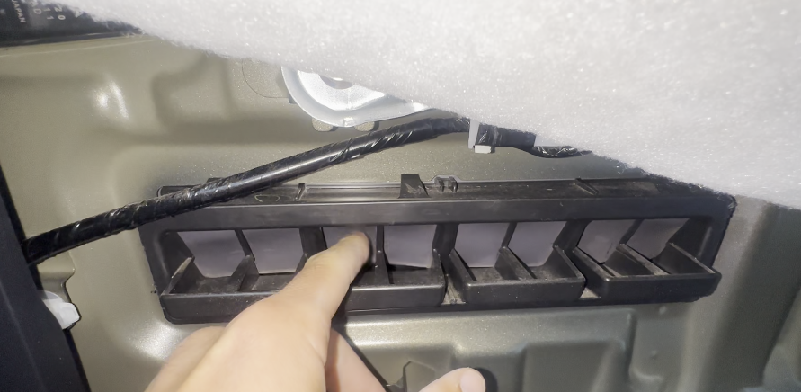
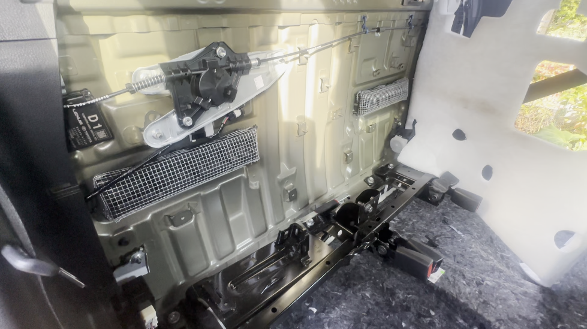

# Mouse proof the rear cabin pressure release vents

Mice got into the cab of our truck through the **rear cabin pressure release vents**. These vents are easy for a mouse to push through (no chewing required), and they're reachable directly from the outside. Covering them with hardware cloth closes off the entry point.

There are **two vents**, one on each side of the rear cabin wall. Repeat the process on both.

## Parts

* [1/4" hardware cloth](https://www.homedepot.com/p/Everbilt-1-4-in-Mesh-x-2-ft-x-5-ft-23-Gauge-Galvanized-Steel-Hardware-Cloth-308231EB/205960850)
* [14" zip ties](https://www.homedepot.com/p/HDX-14-in-UV-Resist-Zip-Ties-Black-20-Pack-FT-370STUV-20/307799374) (4 per vent, so 8 total)

## Tools

* Tin snips or heavy wire cutters (for the hardware cloth)
* Socket set (for the three bolts on the rear trim)

## Video

<iframe width="560" height="315" src="https://www.youtube.com/embed/7gXlz_szecM?si=Fq7i50Ro5pDq9xWE" title="YouTube video player" frameborder="0" allow="accelerometer; autoplay; clipboard-write; encrypted-media; gyroscope; picture-in-picture; web-share" referrerpolicy="strict-origin-when-cross-origin" allowfullscreen></iframe>

## Part 1: Remove the trim to reach the vents

1. **Remove the rear seats.** See [this video](https://youtu.be/IXgf7_ZeJuY).
2. **Unclip the floor edge board.** Pull up on it from all sides until it unclips. Repeat on the other side.
3. **Remove the two trim pins.** Push down on the center of each pin with any tool, then pull it out. Repeat on the other side.
4. **Remove the under-seat side trim piece.** Pull up on the front portion, then pull the piece out toward the front of the truck. Repeat on the other side.
5. **Remove the three bolts** on the rear trim.
6. **Remove the rear trim.** The push clips are mostly along the top, so start at the upper edges and slowly pull until they unclip on both sides, then remove the whole piece.
7. **Move the sound proofing aside** to expose the vents.

## Part 2: Install the mesh

### Cut and shape the mesh

1. **Cut a piece of hardware cloth that is 49 by 17 squares.**
2. **Bend and trim the corners** so the mesh wraps around the vent like a box. I bent:
   * 3 squares along the top and sides
   * 5 squares along the bottom

### Secure the mesh

Use **4 zip ties per vent**:

1. Run one zip tie along the **top** and one along the **bottom**, weaving each under the plastic retaining clips of the vent. This is a little tricky, but once the zip ties are through, they hold securely.
2. Run a separate zip tie along **each side**, connecting the top and bottom zip ties.
3. Trim the excess zip tie tails.

Repeat for the second vent.

## Part 3: Reassemble

Reinstall everything in reverse order: sound proofing, rear trim (clips and three bolts), under-seat side trim, trim pins, floor edge board, and rear seats.
