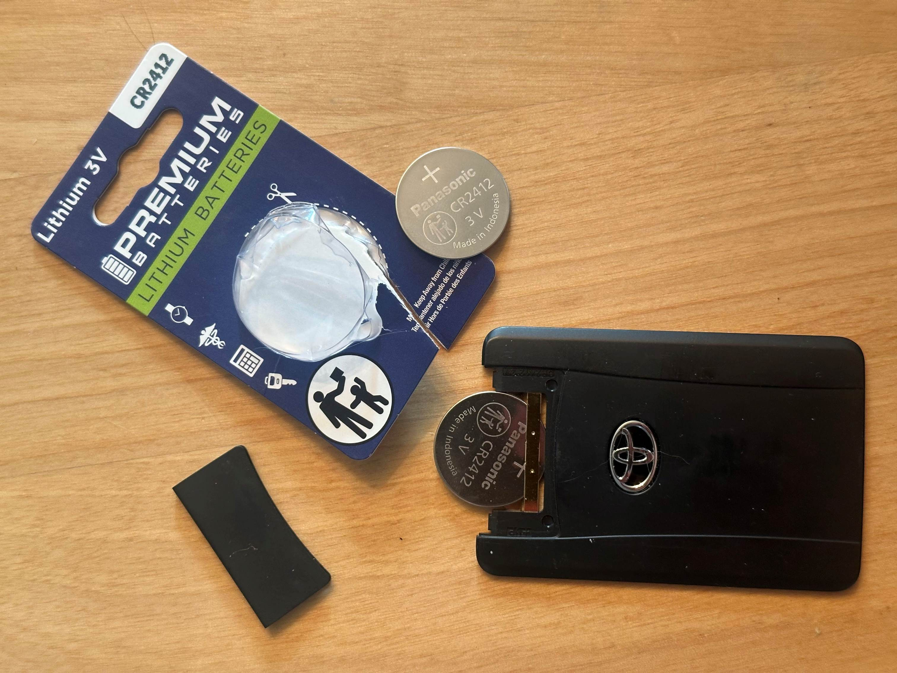

The wallet key battery (otherwise called the Toyota Smart Key Card or Smart Access Key Card) in my 2024 Toyota Tacoma lasted [longer than the normal key fob battery](./key-fob-battery.md). But after about 2 years, my wallet key battery died.

The battery for the wallet key is [CR2412](https://www.amazon.com/dp/B0GH8RQZNY). I bought a new one from [Key Battery Outlet Store](https://www.amazon.com/dp/B0GH8RQZNY) since they had the best ratings!!

The factory battery is Panasonic brand, and the battery from [Key Battery Outlet Store](https://www.amazon.com/dp/B0GH8RQZNY) was actually also Panasonic brand, even though their thumbnails showed "KBO"! So that was a pleasant surprise!

You can also buy the [Panasonic CR2412](https://www.amazon.com/Panasonic-CR2412-Lithium-Battery-Batteries/dp/B01AN8KRJW) specifically, but their reviews seemed a bit more mixed.