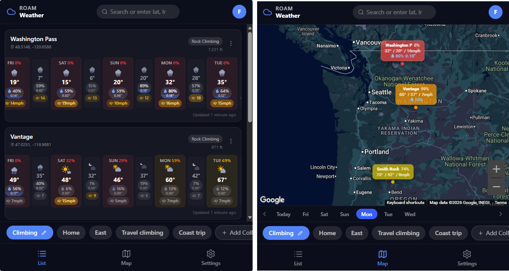
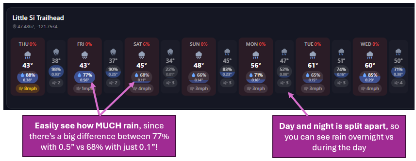
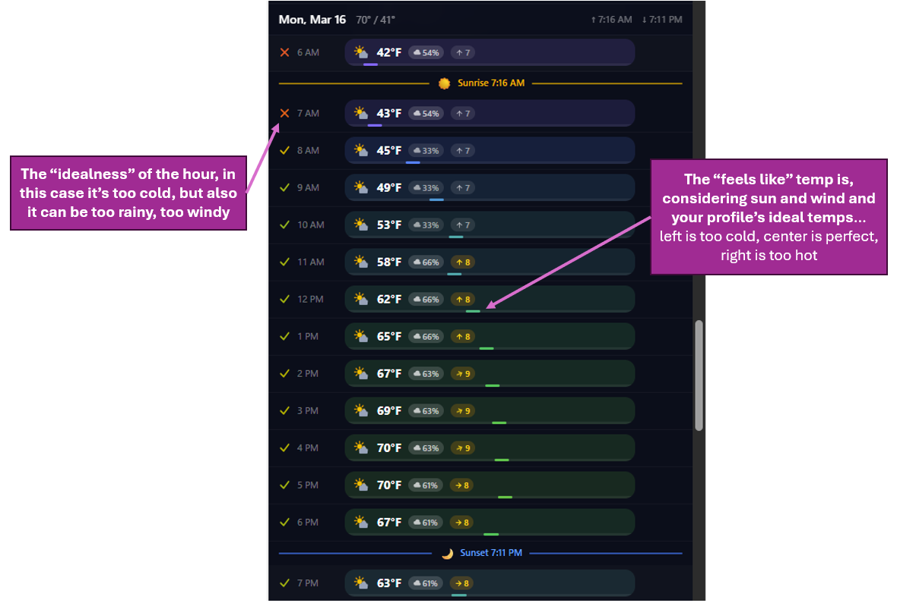

# Weather Forecasts

When you're deciding between two camping or climbing spots for the weekend, checking NOAA for each location separately makes it hard to compare them at a glance. I built **[Roam Weather](https://weather.roamapps.com)** to solve exactly that — save all your go-to locations, see their forecasts side by side, and score each one so you can quickly see which spot will be best on which day.

## Try it

- **Web app:** [weather.roamapps.com](https://weather.roamapps.com)
- **iOS:** [App Store](https://apps.apple.com/us/app/roam-weather/id6760034245)
- **Android:** [Google Play](https://play.google.com/store/apps/details?id=com.roamapps.weather)

Example forecasts:
- [Vantage, WA](https://weather.roamapps.com/forecast/47.02511/-119.96812?name=Vantage&profile=default-1)
- [Smith Rock, OR](https://weather.roamapps.com/forecast/44.36797973821408/-121.13945857251312?name=Smith+Rock&profile=default-1)

## How it works

1. **Save your spots.** Add all your trailheads, crags, and campsites — organize them into collections like "PNW Climbing" or "Summer Backpacking."
2. **See them all at once.** The list view shows every location with a scrollable 7-day forecast strip. The map view shows all your spots with color-coded pins. No more flipping between tabs.
3. **Get an idealness score.** Define what "good weather" means for your activity — preferred temp ranges, max wind, acceptable precip chance — and every forecast day gets scored. Instantly see that Saturday at Vantage is 92% ideal while Washington Pass is sitting at 45%.
4. **Drill into the details.** Tap any location for the full hourly breakdown — temperature, wind, precipitation, humidity, and dewpoint.

## Features worth knowing

- **Offline support** — Install the iOS or Android app and your cached forecasts are available even without cell service.
- **Elevation-adjusted temps** — Forecasts are adjusted to the actual elevation of your saved location, not NOAA's grid elevation (which can vary a lot within a single grid cell).
- **Sunlight-adjusted "feels like"** — The idealness score accounts for cloud cover, since 45°F sunny is a very different experience than 45°F overcast.
- **Shareable links** — Send a forecast link for any coordinates to your partners. No account needed to view.
- **US + international** — Uses NOAA's APIs in the US for highly accurate alpine forecasts, and Pirate Weather (equally accurate) for everywhere else.

## Pricing

Free to save up to 6 locations. Beyond that, upgrade to Premium:

- **$1.29/month**
- **$5.99/year**
- **$11.99 lifetime**

All purchases are non-recurring — no forgotten subscriptions. Prices are lower on the web version since Apple takes a cut on iOS purchases.
