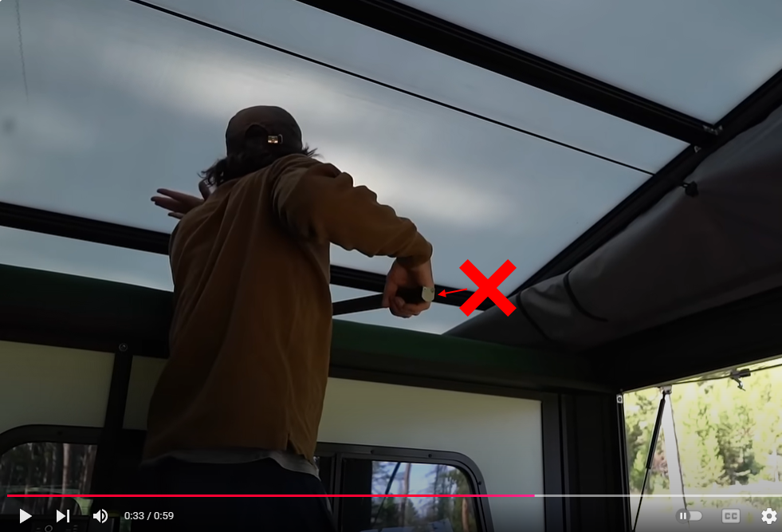
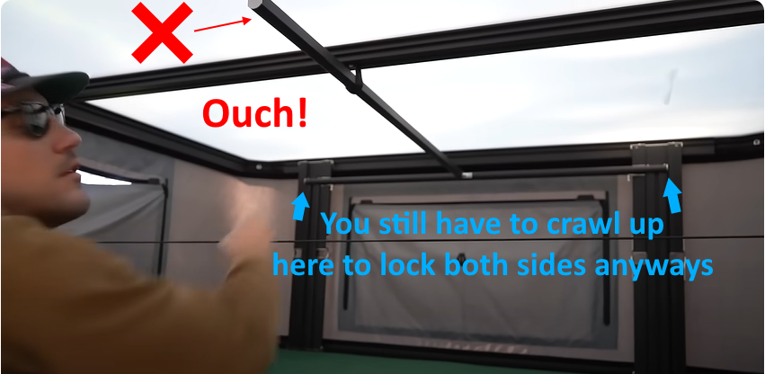
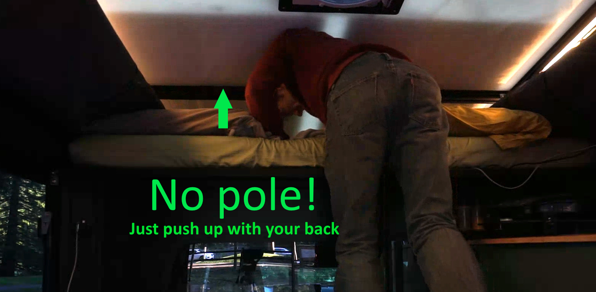
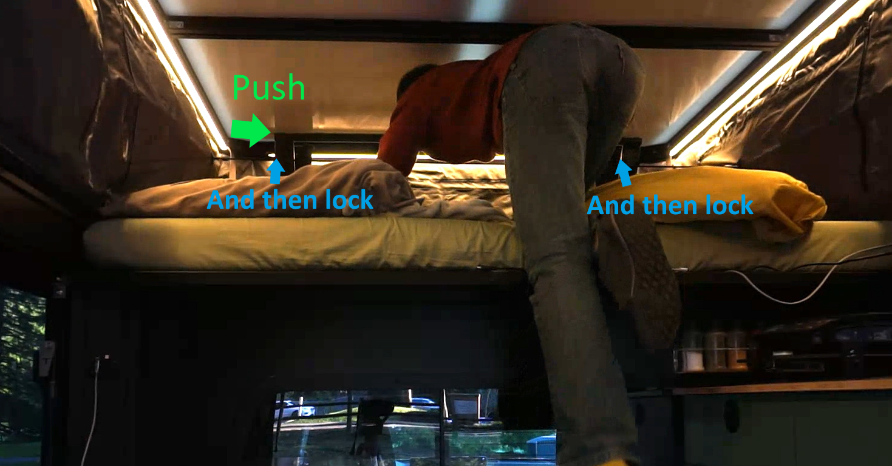

# Removing the interior push pole

Tune's come with this weird hanging pole on the inside that rests just above the bed, with a little velcro strap that holds it up on the ceiling. **It's a head-hitting magnet** and doesn't seem like the best design.

It's used to help push up the front lever when popping up the camper. However, it kinda weirdly is in the way.

The good news is that you can REMOVE it, and you probably won't even miss it! And that'll take off a few pounds of weight! Some people move it further to the right, but I realized you might as well just remove it!

## Popping up comparison

With the pole | Without the pole
--|--
Press the back up | Press the back up
Take off a shoe to step up on your seat and get into pushup position on the front of the bed, push up the middle front using your back | Take off a shoe to step up on your seat and get into pushup position on the front of the bed, push up the middle front using your back
Once the front is mostly up, **unvelcro the pole and push the front lever with the pole till it's up**. | Once the front is mostly up, **crawl up on the bed and push the front lever all the way up**.
**Crawl up on the bed** and twist the two safety latches on the front to the locked position. | Twist the two safety latches on the front to the locked position. 

Notice that you have to crawl up to the front of the bed anyways to secure the safety latches, so the pole really didn't help with anything! Taking it down is the same in reverse.

We removed our pole and haven't missed it since! You just need an allen wrench to remove one bolt on the front of the pole!